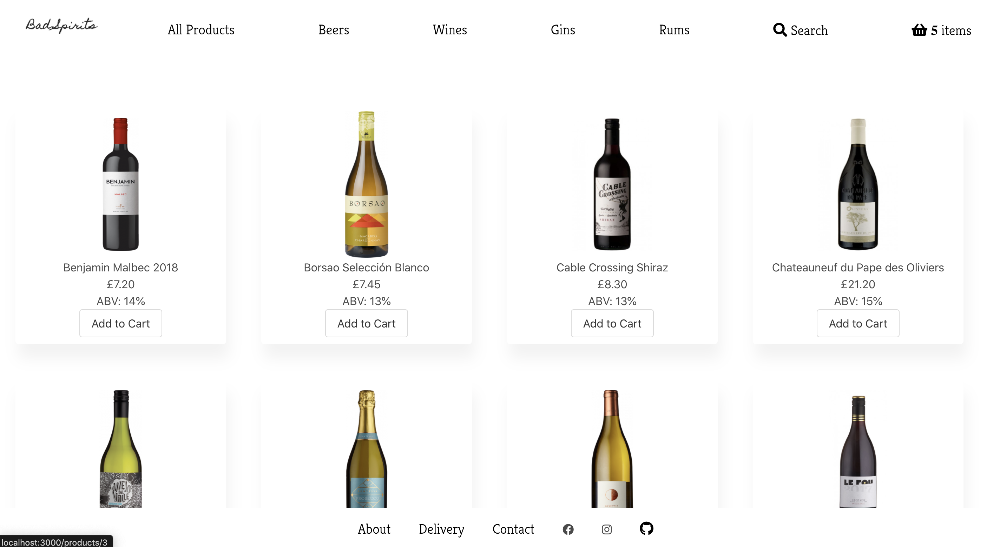
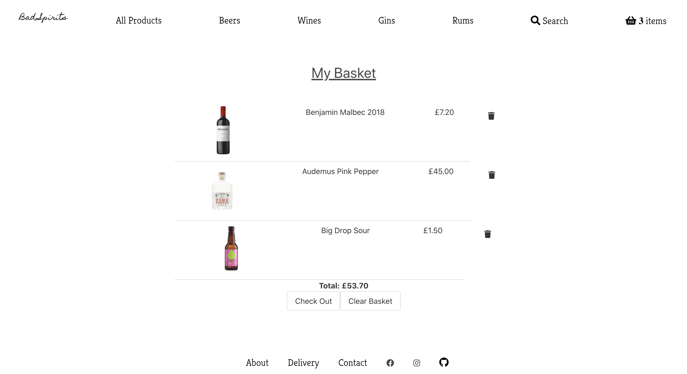
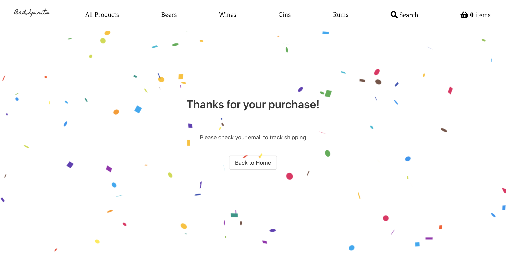

# Bad_Spirits - online shop

### About
This web app was built using React & Spring which pulls a list of products from an external API. The user can then view all products, filter products and add products to their shopping cart. Once the user completes the checkout process, a new order is placed in the database & stock levels are updated in the product databse. 

### Setup
##### Client

    cd client
    npm install
    npm run start

This should open a browser windown, if not go to http://localhost:3000

##### Server
    cd server
    idea .
Run ServerApplication in Intelli J

Now refresh localhost:3000 and products will be displayed.

http://localhost:8080/api can be used to fetch API requests using the following routes:
* /products  -  to view all products
* /products/:id. -  to view one product
* /products/find/:category. -  to view all products of certain category (e.g beer, wine)

* /orders  -  to view all orders
* /orders/:id. -  to view one order

#### Authors
Craig Laws
Kat Kmiotek
Stuart Meldrum

